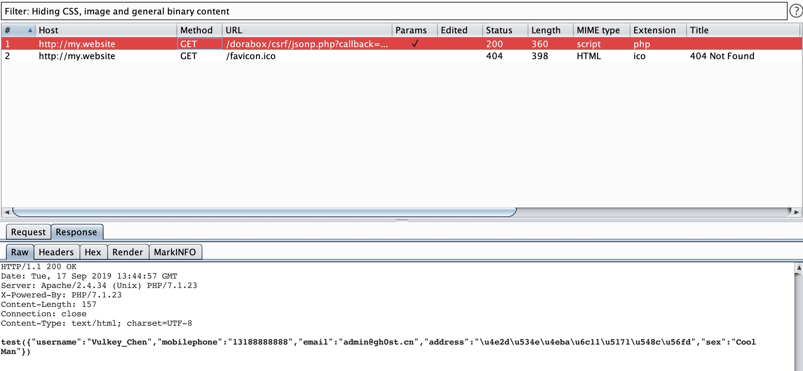
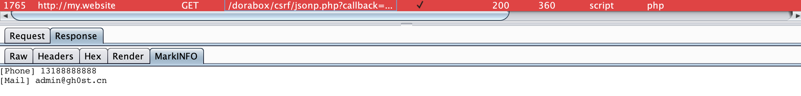
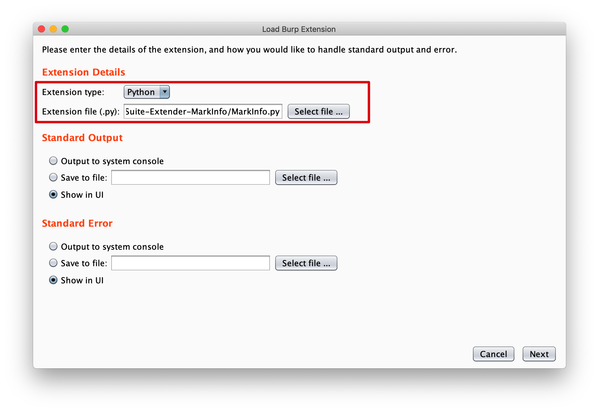

# BurpSuite-Extender-MarkInfo

>Author: Vulkey_Chen
>
>Team: Mystery Security Team
>
>Email: admin@gh0st.cn
>
>Blog: gh0st.cn

I build a burpsuite extension to mark sensitive information.

e.g. If "mobile phone number" and "email address" information appear in the response content, then mark this request for red color.

## About it

Sensitive information is divided into three categories: `MobilePhone Number` \ `Email Address` \ `Chinese IDCard`

1.Marked as **yellow** when one of the information exists

2.Marked as **red** when two of the information exists

There is a tab called `MarkInfo` that shows matching information.

## Usage

BurpSuite -> Tab:Extender -> Tab:Extensions -> Add 

